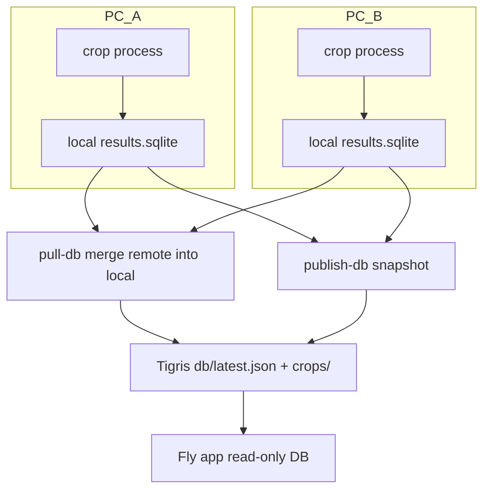

# Multi-machine crop coordination

Three (or more) PCs can crop in parallel without duplicating work, as long as they share the **published** coordination DB on Fly Tigris and follow a simple split + sync loop.

## How coordination works



1. **`pull-db`** — downloads the live published snapshot and **merges** actas this machine does not have yet (`document_id` is the lock; local wins on conflicts).
2. **`process --crop-only`** — skips any `document_id` already in the local DB (including merged from other PCs).
3. **`publish-crops`** — uploads PNGs to Tigris (keys are deterministic: `crops/...`, no collisions).
4. **`publish-db`** — merges remote again, then snapshots and updates `db/latest.json` (so the live DB is the union of all machines).

**Important:** Never point two PCs at the same `output-dir` over NFS. Each machine should have its own local `data/detector_national` (or named variant) and sync through Tigris.

## Recommended: split by department

Disjoint department ranges avoid races and make progress easy to read:

| Machine | Env | Departments |
|---------|-----|-------------|
| PC 1 | `E14_DEPT_FROM=00` `E14_DEPT_TO=16` | 00–16 |
| PC 2 | `E14_DEPT_FROM=17` `E14_DEPT_TO=33` | 17–33 |
| PC 3 | `E14_DEPT_FROM=34` `E14_DEPT_TO=99` | 34–99 |

Adjust ranges to match [`data/mesa_universe.csv`](data/mesa_universe.csv) counts (`make detector-crop-progress` shows per-dept %).

## Setup per machine

```bash
# Same repo + PDFs (copy or rsync data/actas/)
make setup
pip install -e ".[publish]"   # boto3 for pull-db / publish

# .env from fly storage create (AWS_* + BUCKET_NAME + E14_CDN_BASE_URL)
```

### WSL fleet networking (Tailscale)

Install Tailscale **inside WSL** on each machine (same account). Direct WSL→WSL SSH on port 22 — no Windows port forwarding needed.

```bash
bash scripts/wsl-tailscale-setup.sh   # both machines; rename hosts in Tailscale admin
ssh quicazan@ryzen9                   # test from worker → lead
```

Copy PDFs + `.env` from the lead:

```bash
bash scripts/pull_from_lead.sh --probe   # inspect remote paths
bash scripts/pull_from_lead.sh           # rsync data/actas/ + .env (~22 GB)
```

Override lead host/repo if needed: `E14_LEAD_HOST=100.x.x.x` or `E14_LEAD_REPO=/path/to/e14`.

**Fallback:** Windows-hosted SSH via portproxy — `scripts/windows-wsl-ssh-portproxy.ps1` (Admin PowerShell on the lead).

### Worker env + supervisor

```bash
source scripts/crop_worker_env.sh    # set E14_DEPT_FROM / E14_DEPT_TO / workers
nohup bash scripts/start_crop_worker.sh >> logs/crop_supervisor.log 2>&1 & disown
```

The supervisor runs **`pull-db`** before each crop pass so restarts pick up other machines' progress.

## Manual commands

```bash
# Sync from Fly before cropping
.venv/bin/e14detector pull-db --output-dir data/detector_national

# Crop one department slice only
.venv/bin/e14detector process --input-dir data/actas --output-dir data/detector_national \
  --workers 32 --crop-only --dept-from 17 --dept-to 33

# Publish (merges remote first by default)
.venv/bin/e14detector publish-crops --output-dir data/detector_national
.venv/bin/e14detector publish-db --output-dir data/detector_national --only-uploaded
```

## Env reference

| Variable | Purpose |
|----------|---------|
| `E14_CDN_BASE_URL` | Public Tigris base (for pull-db via HTTP) |
| `BUCKET_NAME` / `AWS_*` | S3 API for pull/publish |
| `E14_DB_MERGE_BEFORE_PUBLISH` | `1` (default): merge remote before `publish-db` |
| `E14_DEPT_FROM` / `E14_DEPT_TO` | Department slice for crop supervisor |
| `E14_WORKER_ID` | Label in supervisor logs only |

## One designated publisher (optional)

To reduce pointer races, only **one** PC can run `publish-db`; the others run crop + `publish-crops` only. With `pull-db` before each publish and disjoint dept ranges, multiple publishers are usually fine.
