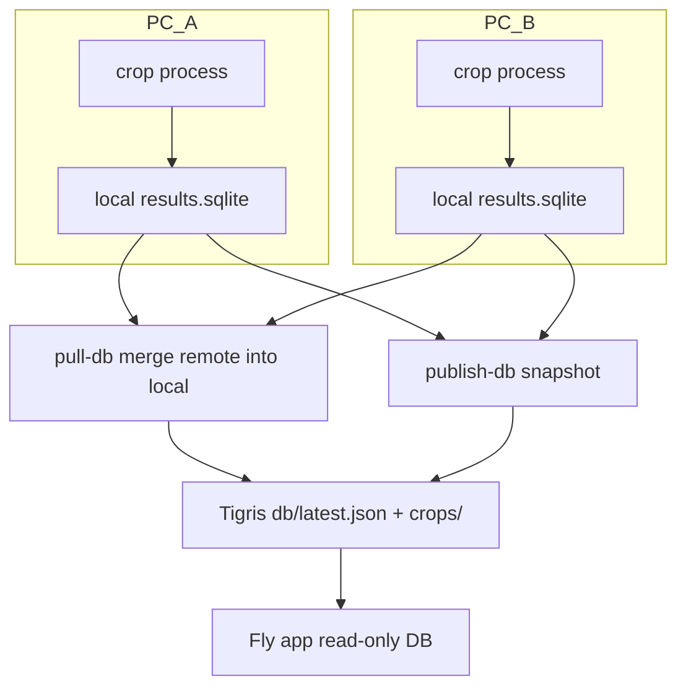

# Multi-machine crop coordination

> **Publishing from each machine is now unified under [`e14 sync`](SYNC.md).** The fleet
> coordination (department queue, worker bootstrap) is still detector-CLI specific and described
> here, but every machine should publish via `e14 sync run`, which enforces the count-model rules
> so the fleet can't desync the served counts.

Three (or more) PCs can crop in parallel without duplicating work, as long as they share the **published** coordination DB on Fly Tigris and follow a simple split + sync loop.

## How coordination works



1. **`pull-db`** — downloads the live published snapshot and **merges** actas this machine does not have yet (`document_id` is the lock; local wins on conflicts).
2. **`process --crop-only`** — skips any `document_id` already in the local DB (including merged from other PCs).
3. **`publish-crops`** — uploads PNGs to Tigris (keys are deterministic: `crops/...`, no collisions).
4. **`publish-db`** — merges remote again, then snapshots and updates `db/latest.json` (so the live DB is the union of all machines).

**Important:** Never point two PCs at the same `output-dir` over NFS. Each machine should have its own local `data/detector_national` (or named variant) and sync through Tigris.

## Recommended: fleet queue (one department per assignment)

The **fleet scheduler** on the lead PC assigns the next largest incomplete department to each idle worker. Workers crop `--depto` one at a time, publish completion, and pick up the next assignment. State lives in `data/detector_national/fleet/queue.json` and syncs via Tigris (`pull-fleet` / `publish-fleet`).

| Role | Machine | Script |
|------|---------|--------|
| Coordinator | ryzen9 WSL (`ryzen9-1`) | `scripts/fleet_scheduler.sh` |
| Worker | each PC | `scripts/start_crop_fleet_worker.sh` |

```bash
# Both machines — WSL Tailscale hostnames must match worker ids
export E14_FLEET_WORKERS=ryzen9-1,legion-1
export E14_FLEET_COORDINATOR=ryzen9-1
export E14_WORKER_ID=ryzen9-1   # or legion-1 on the other PC

# Lead (ryzen9) — stop unbounded crop_supervisor.sh first, then:
nohup bash scripts/fleet_scheduler.sh >> logs/fleet_scheduler.log 2>&1 & disown
nohup bash scripts/start_crop_fleet_worker.sh >> logs/crop_supervisor.log 2>&1 & disown

# Worker (legion) — after pull_from_lead.sh:
export E14_WORKER_ID=legion-1
nohup bash scripts/start_crop_fleet_worker.sh >> logs/crop_supervisor.log 2>&1 & disown
```

Manual ops: `e14detector fleet-status`, `fleet-schedule`, `fleet-current --worker legion-1`.

Only **one** `crop_supervisor_fleet.sh` per `E14_WORKER_ID` (file lock under `/tmp/e14-crop-supervisor-<worker>.lock`). A second start exits immediately — check with `pgrep -af crop_supervisor_fleet`.

### Legacy: static department ranges

Fixed ranges still work (`E14_DEPT_FROM` / `E14_DEPT_TO` + `scripts/start_crop_worker.sh`). Prefer fleet mode when two PCs should stay busy without overlapping.

### Memory (required before high worker counts)

Some actas render to 80–144 MP at 300 DPI and can OOM-kill workers. **`E14_MAX_RENDER_MP=50`** (default in `crop_worker_env.sh`) clamps render size; keep it on when using many workers.

```bash
export E14_MAX_RENDER_MP=50   # do not disable on 24GB WSL
```

## Setup per machine

```bash
git checkout feature/multi-machine-crop-sync && git pull
python3 -m venv .venv && source .venv/bin/activate
pip install -e ".[publish]"   # boto3 for pull-db / publish

# .env (Tigris / Fly): encrypted in git as .env.secret (git-secret + GPG)
# Install once: git clone https://github.com/sobolevn/git-secret.git /tmp/git-secret && \
#   cd /tmp/git-secret && make build PREFIX=$HOME/.local && make install PREFIX=$HOME/.local
# Reveal (interactive WSL terminal — enter GPG passphrase if you set one at keygen):
bash scripts/reveal_env.sh
# Or: export PATH="$HOME/.local/bin:$PATH" && git secret reveal
# Fallback: pull_from_lead.sh copies plaintext .env from Ryzen if already revealed there.
```

### WSL fleet networking (Tailscale)

Install Tailscale **inside WSL** on each machine (same account). Direct WSL→WSL SSH on port 22 — no Windows port forwarding needed.

```bash
bash scripts/wsl-tailscale-setup.sh   # both machines; rename hosts in Tailscale admin
ssh quicazan@ryzen9-1                 # test from worker → lead (WSL Tailscale name)
```

Copy PDFs + `.env` from the lead:

```bash
bash scripts/pull_from_lead.sh --probe   # inspect remote paths
bash scripts/pull_from_lead.sh           # rsync data/actas/ + .env (~22 GB)
```

Override lead host/repo if needed: `E14_LEAD_HOST=100.x.x.x` or `E14_LEAD_REPO=/path/to/e14`.

### Worker env

```bash
source scripts/crop_worker_env.sh    # E14_WORKER_ID, E14_FLEET_WORKERS, workers
```

Fleet workers run **`pull-db`** and **`pull-fleet`** before each department; the coordinator runs **`fleet-schedule`** every ~2 min.

## Publishing across machines (Legion + Ryzen)

Crop keys are global on Tigris (`crops/<file>`). Each host keeps `review/uploaded_crops.txt`; **`publish-reconcile`** lists the bucket and unions keys so no machine re-uploads the fleet’s work.

```bash
# Once per machine (or after a big upload burst on another host)
.venv/bin/e14detector publish-reconcile --output-dir data/detector_national

# National loop (lead) — one supervisor at a time
nohup bash scripts/publish_supervisor.sh >> logs/publish_loop.log 2>&1 & disown

# Or one department at a time (divide-and-conquer)
bash scripts/publish_dept_crops.sh 16
WORKERS=64 bash scripts/publish_dept_crops.sh 19

# Live status (uses bucket cache; does not block on full bucket list)
bash scripts/publish_status_by_dept.sh --watch
```

When **all 122,007** actas are in the upload frontier, publish the slim serving DB (may need `--allow-shrink` if the live pointer is an older, larger schema):

```bash
.venv/bin/e14detector publish-db --output-dir data/detector_national --only-uploaded --allow-shrink
```

Run **`publish-reconcile` on Legion** after Legion uploads so its manifest matches Tigris. Do not run **`publish-reconcile`** on Ryzen while **`publish-loop`** is appending to the manifest.

## Manual commands

```bash
# Sync from Fly before cropping
.venv/bin/e14detector pull-db --output-dir data/detector_national

# Crop one department slice only
.venv/bin/e14detector process --input-dir data/actas --output-dir data/detector_national \
  --workers 32 --crop-only --dept-from 17 --dept-to 33

# Publish (merges remote first by default)
.venv/bin/e14detector publish-crops --output-dir data/detector_national
.venv/bin/e14detector publish-crops --department 16   # optional: one dept only
.venv/bin/e14detector publish-db --output-dir data/detector_national --only-uploaded
```

## Env reference

| Variable | Purpose |
|----------|---------|
| `E14_CDN_BASE_URL` | Public Tigris base (for pull-db via HTTP) |
| `BUCKET_NAME` / `AWS_*` | S3 API for pull/publish |
| `E14_DB_MERGE_BEFORE_PUBLISH` | `1` (default): merge remote before `publish-db` |
| `E14_DEPT_FROM` / `E14_DEPT_TO` | Department slice for crop supervisor |
| `E14_WORKER_ID` | Fleet worker id (WSL Tailscale name, e.g. `legion-1`) |
| `E14_FLEET_WORKERS` | Comma-separated ids for scheduling |
| `E14_FLEET_COORDINATOR` | Lead worker id (runs `fleet-schedule`) |
| `E14_FLEET_SCHEDULE_INTERVAL` | Coordinator loop seconds (default `120`) |
| `E14_FLEET_STALE_SEC` | Reclaim stale claims (default `7200`) |
| `E14_MAX_RENDER_MP` | Max megapixels per rendered page (default `50`; prevents OOM) |
| `E14_CROP_WORKERS` | Process pool size (default `24` with clamp on ryzen9-class boxes) |

## One designated publisher (optional)

To reduce pointer races, only **one** PC can run `publish-db`; the others run crop + `publish-crops` only. With `pull-db` before each publish and disjoint dept ranges, multiple publishers are usually fine.
